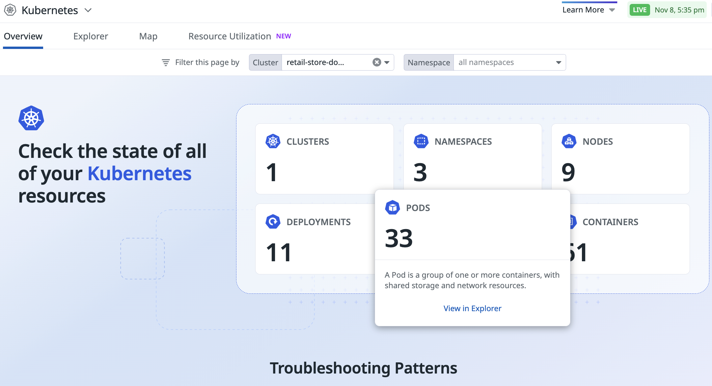

# Installing the Datadog EKS add-ons

*describe the architecture for the add-on, operator/agent*

## 0 Create a Datadog account

1. If you already have a Datadog account, then continue to step 2.
1. Head over to [Datadog](https://www.datadoghq.com/) and click the "Free Trial" button.
1. Create your free 14-day trial account. Any accounts with `@amazon.com` emails will automatically reset the free-trial.

## 1 Provision an EKS Cluster

You will need a cluster to install the add-on into.
1. If you already have a cluster to use, goto step 1.1
2. Create an EKS Cluster 

### 1.1 Compute

Not all compute options for EKS are currently supported.
Verify your cluster has supported worker nodes.

| EKS Compute Option | Supported |
|--------------------|-----------|
| ECS                |   &#9635; |
| Fargate            |   &#9634; |

*TODO: Add support for Fargate*

## 2 Install add-on

### 2.1 AWS Console

1. Login to the AWS console and select EKS
1. Mavigate to your cluster
1. Select the "Add-ons" tab, then the 
 button.
1. Scroll down to the "AWS Marketplace add-ons" section
1. Select Datadog from the "Any vendor" drop-down
1. Choose the "Datadog Operator" add-on by selecting the box and click "Next"
1. Choose either the default or latest "Version"
1. For the IAM Role, the default "Inherit from node" works.
1. At this time, there are no "Optional configuration settings"
1. Set the "Conflict resolution method" to "None"
1. Click "Next", then "Create" on the next page.

This will kick-off the add-on install process, which will inject a Datadog Operator into your cluster.

### 2.2 Command Line

*TODO*

## 3 Create Datadog API key

1. Login to your Datadog account
1. In the lower left-hand toolbar, click on your account name. A menu will popup, select "Organizational Settings" and then "API Keys"
1. Create an API key.

## 4 Create a Kubernetes Secret for the API key

### 4.1 AWS Console

*TODO*

### 4.1 Command Line

When the Datadog EKS add-on installs, by default it will install into the Namespace `datadog-agent`.
These instructions, assume you're using the default.

1. In a terminal, ensure you are authenicated properly to use the `aws` command line tool.
1. Validate `kubectl` works and your context points to the proper cluster.
1. Run the following to create a Secret for your Datadog API key
```
kubectl -ns datadog-agent create secret generic datadog-agent --from-literal=api-key=<YOUR-API-KEY> --from-literal=app-key=<YOUR-APP-KEY>
```
*TODO: How to use AWS Secret Manager*
*TODO: How to override the default namespace*

## 5 Deploy the Datadog agent

### 5.1 Create a Datadog agent instance manifest
The Datadog agent is deployed by creating an instance of the Custom Resource Definition for an agent which the add-on installed into your cluster. (You can see these CRDs by running `kubectl get crds`.).

1. There are a number of optional settings. See the [Datadog docs](https://docs.datadoghq.com/containers/kubernetes/installation/?tab=operatorq) for details on these options.
Copy and save the following in a file called `datadog-agent-instance.yaml` somewhere convienient to the directory you're running `kubectl` from.

```
apiVersion: datadoghq.com/v2alpha1
kind: DatadogAgent
metadata:
  name: datadog
spec:
  global:
    # required in case Agent can not resolve cluster name through IMDS, see the note below.
    clusterName: retail-store-dog-1
    registry: 709825985650.dkr.ecr.us-east-1.amazonaws.com/datadog
    credentials:
      apiSecret:
        secretName: datadog-secret
        keyName: api-key
      appSecret:
        secretName: datadog-secret
        keyName: app-key
  features:
    #processDiscovery:
    #  enabled: true
    liveContainerCollection:
      enabled: true
    apm:
      enabled: true
    liveProcessCollection:
      enabled: true
    logCollection:
      enabled: true
    admissionController:
      enabled: true
    externalMetricsServer:
      enabled: true
    cspm:
      enabled: true
    cws:
      enabled: true
    orchestratorExplorer:
      enabled: true
```

### 5.2 Deploy a Datadog agent

1. Run the following command to deploy an agent instance. Note this sample uses the default namespace and manifest filename, please adjust as appropriate.

```
kubectl -ns datadog-agent apply -f datadog-agent-instance.yaml
```

## 6 Verify agent running

1. Run `kubectl get pods` to verify Datadog agent(s) are running.
1. Your results may vary depending on your cluster configuration.
1. Verify you the pods are running with the following name conventions:
    1. 1 `operator-eks-addon-datadog-operator-xxxxxxxxxx-xxxxx` pod
    1. 1 `datadog-cluster-agent-75f44cd57b-86lx7` pod  
    1. 1 or more `datadog-agent-xxxxxx` pods

## 7 (optional) Deploy a workload into your cluster

*TODO*

## 8 Verify in Datadog

1. Back in Datadog, again in the left-side menu, select "Infrastructure" and then "Kubernetes"
1. Verify you see your cluster

 